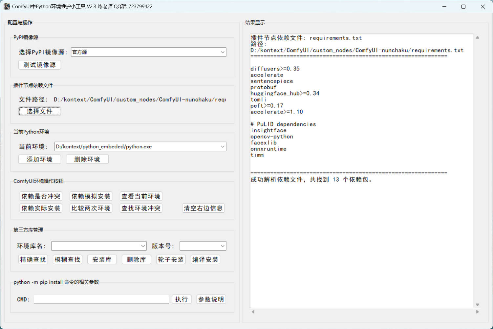

# ComfyUI环境维护小工具

一款专为ComfyUI用户设计的Python环境维护与管理工具，帮助您轻松管理、检查和优化Python包环境，确保ComfyUI稳定运行。

## 📋 项目简介

这是一款功能全面的图形界面工具，专为ComfyUI用户打造，用于管理Python包依赖、检测环境冲突、优化镜像源以及执行各种环境维护任务，让您的ComfyUI运行环境始终保持最佳状态。

- 提供直观的图形界面，无需复杂的命令行操作
- 全面检测和解决Python包依赖冲突问题
- 支持多环境管理和环境迁移功能
- 内置多个国内镜像源，加速包下载
- 丰富的功能集，满足ComfyUI环境维护的各种需求

## 📄 更新日志

**最新版本：V2.4**

**更新内容：**

- 10月7日正式更新V2.4版本：增加环境迁移功能，用户可以将当前环境迁移到新环境，无需重新安装所有包；修复部分已知bug
- 10月3日更新V2.3版本：增加cmd命令行执行功能，无需打开黑窗口执行命令；参数说明列出pip install相关参数；增加轮子安装和编译安装支持
- 9月17日更新：环境使用下拉列表选择，并在程序当前目录生成保存环境的文本文件，避免每次寻找环境地址
- 优化程序界面布局和响应速度
- 增强镜像源测试和管理功能
- 修复subprocess调用相关的兼容性问题
- 改进代码结构，提升程序稳定性
- 完善错误处理和用户提示

**使用说明：**

- 详细使用教程请参考B站视频：
  - https://www.bilibili.com/video/BV1pwHfzkEFs/?spm_id_from=333.1387.homepage.video_card.click&vd_source=c1985a7ed12db7995eeb206791daddbd
  - https://www.bilibili.com/video/BV1GrxjzSE36?vd_source=c1985a7ed12db7995eeb206791daddbd&spm_id_from=333.788.videopod.sections

## 🤝 技术支持

- **作者**：练老师
- **QQ交流群**：723799422（欢迎加入交流使用经验和问题反馈）
- **当前版本**：V2.4
- **更新频率**：定期更新，修复问题并增加新功能
- **问题反馈**：在使用过程中遇到问题，请在QQ群中反馈或参考B站教程视频

## 🚀 功能特点

- **现代化图形界面**：操作直观简便，适合各类用户使用
- **多镜像源支持**：内置阿里云、清华大学、中科大等主流国内镜像源
- **依赖冲突检测**：全面分析当前环境与新依赖之间的版本兼容性
- **模拟安装验证**：使用`--dry-run`模式提前验证安装兼容性
- **多环境管理**：支持选择和管理不同的Python环境
- **环境迁移功能**：将现有环境完整迁移到新环境，无需重新安装所有包
- **依赖树可视化**：分析并展示包之间的依赖关系
- **镜像源测试**：自动测试并推荐最优镜像源
- **单例应用保障**：确保程序只能打开一个实例，避免资源冲突
- **错误诊断与修复**：提供详细的错误诊断和修复建议
- **批量操作支持**：支持批量安装、卸载和更新包
- **命令行执行**：内置cmd命令行执行功能，无需打开单独的黑窗口
- **轮子与编译安装**：支持通过wheel文件安装和源码编译安装

## 📋 系统要求

- 操作系统：Windows 7/8/10/11
- Python：3.6或更高版本
- pip：已正确安装并配置（推荐最新版本）
- 内存：至少4GB RAM
- 磁盘空间：至少100MB可用空间
- 屏幕分辨率：推荐1280x800或更高
- 网络连接：部分功能需要稳定的网络连接以访问PyPI和镜像源

## 📖 使用指南

### 基本操作流程

1. **启动程序**：运行`Comfyui环境维护小工具.exe`或Python脚本文件
2. **环境选择**：默认使用当前Python环境，可点击"选择环境"按钮切换
3. **镜像源配置**：从下拉菜单中选择合适的PyPI镜像源
4. **执行操作**：根据需要选择相应功能按钮执行操作
5. **查看结果**：在结果显示区域查看操作输出和分析报告

### 核心功能详解

#### 🔍 环境冲突检查
- 点击"检查环境冲突"按钮分析当前环境中的包兼容性
- 支持解析requirements.txt文件中的各类依赖格式
- 详细展示冲突包、版本要求和解决方案

#### 📦 包管理操作
- **安装包**：输入包名和版本，选择安装选项进行安装
- **卸载包**：快速卸载不需要的包及其依赖
- **更新包**：将指定包更新到最新版本或特定版本
- **查看包信息**：获取已安装包的详细信息和版本历史
- **轮子安装**：支持直接安装本地wheel文件，提高安装速度
- **源码编译安装**：支持从源码编译安装特定包，解决兼容性问题

#### 🚀 镜像源优化
- **镜像源测试**：自动测试所有内置镜像源的连接速度
- **智能推荐**：根据测试结果推荐最优镜像源
- **一键切换**：快速切换PyPI镜像源，提升下载速度

#### 🔄 环境迁移
- **启动迁移**：点击"环境迁移"按钮打开迁移对话框
- **选择环境**：选择源环境（当前使用的环境）和目标环境（新环境路径）
- **确认信息**：系统会显示源环境和目标环境的完整路径信息，请仔细核对
- **执行迁移**：确认无误后点击"确定"按钮开始迁移过程
- **查看进度**：通过进度条查看迁移进度，迁移完成后会显示成功提示

环境迁移功能会将源环境中的所有Python包及其依赖完整迁移到目标环境，无需重新下载和安装，大幅节省时间。

#### 📊 环境分析
- **查看当前环境**：显示所有已安装包及其版本信息
- **搜索包**：在已安装包中快速搜索特定包
- **依赖分析**：使用pipdeptree分析和展示包依赖关系
- **冲突库排查**：检测并解决潜在的库冲突问题

#### 💻 命令行执行
- **内置终端**：直接在程序界面中执行cmd命令
- **命令历史**：保存执行过的命令，方便重复使用
- **输出捕获**：实时显示命令执行结果，无需切换窗口

## 🖥️ 界面说明

程序界面采用分区设计，各功能区域清晰可见，操作流程符合用户习惯：

- **顶部导航区**：显示程序名称、版本信息和功能导航菜单
- **环境配置区**：包含Python环境选择下拉菜单、镜像源配置选项和常用操作快捷按钮
- **功能操作区**：按功能分类的操作按钮，包括包管理、环境分析、镜像源优化和环境迁移等
- **结果显示区**：实时展示操作输出、分析报告和错误信息，支持复制和保存输出内容
- **进度指示区**：显示当前操作的进度和状态，提供可视化的完成度反馈
- **命令行执行区**：内置命令行终端，支持直接执行Python和pip相关命令

## 📝 结果解释

程序输出结果使用明确的状态标识，便于快速理解：

| 状态标识 | 含义描述 |
|---------|---------|
| **✅ [正常]** | 已安装的包满足版本要求 |
| **⚠️ [冲突]** | 已安装的包版本与需求不符，需要解决 |
| **🔄 [可更新]** | 包存在可用更新版本 |
| **❌ [未安装]** | 当前环境中未安装此包 |
| **❓ [错误]** | 检查过程中出现错误 |
| **🔗 [Git包]** | 需要从Git仓库安装的特殊包 |

## ⚠️ 注意事项

1. **操作前备份**：在执行重要操作前，请备份您的Python环境，以防万一
2. **模拟安装优先**：建议先使用模拟安装功能验证兼容性，再执行实际安装
3. **管理员权限**：某些操作（如环境迁移、系统级包安装）可能需要管理员权限，请以管理员身份运行程序
4. **文件编码**：确保requirements.txt文件使用UTF-8编码格式，避免解析错误
5. **网络连接**：部分功能（如镜像源测试、在线安装）需要稳定的网络连接
6. **环境迁移谨慎**：在执行环境迁移操作时，请仔细核对源环境和目标环境路径，避免误操作
7. **磁盘空间**：环境迁移前，请确保目标分区有足够的磁盘空间存放所有包文件

## 💡 使用建议

1. **定期检查**：定期使用"检查环境冲突"功能，预防潜在问题
2. **预验证**：在安装新包前，先使用模拟安装功能验证兼容性
3. **镜像优化**：根据网络环境选择合适的镜像源，提升下载速度
4. **依赖分析**：如遇复杂依赖问题，使用"依赖分析"功能进行排查
5. **组合操作**：对于频繁使用的功能，建议将常用操作组合使用
6. **环境管理**：为不同的ComfyUI项目创建独立的Python环境，避免相互影响
7. **环境备份**：在环境配置完成后，可使用环境迁移功能创建备份环境
8. **命令行结合**：复杂操作可结合内置命令行执行功能，获得更高的灵活性

## 📌 免责声明

本工具旨在提供便捷的Python环境管理功能，但不对操作结果做任何保证。在对重要环境进行操作前，请务必做好备份工作。如因使用本工具导致任何损失，作者不承担任何责任。